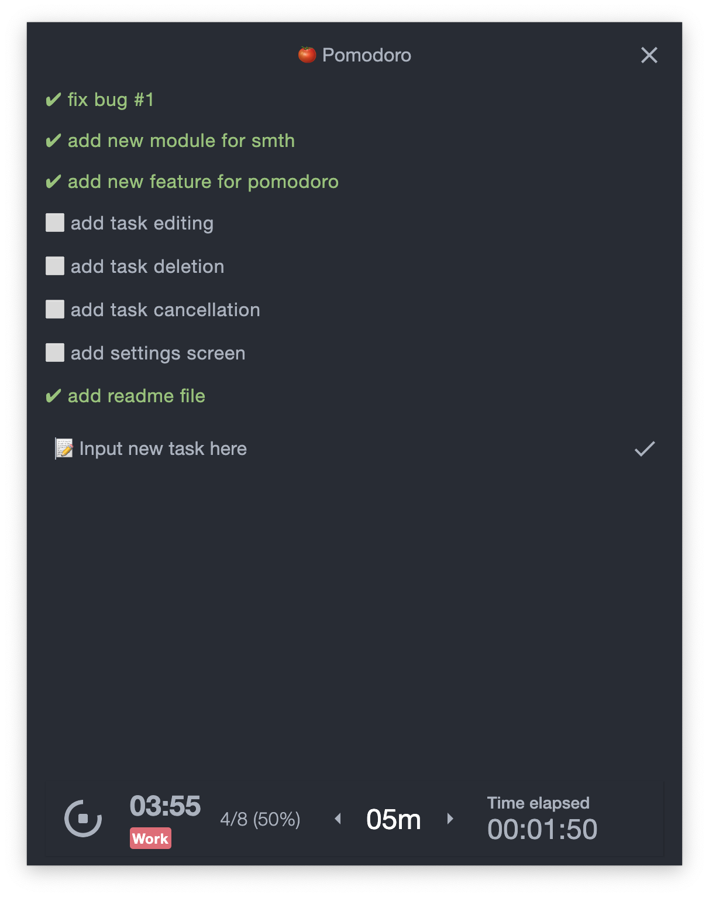

# Pomodoro :tomato:

Small task & time tracker with work time limitation system

## Features
- Set work period time 
- Task adding 
- Toggle task completion
- Input shortcuts (currently only on windows)
  - Alt + D toggle task completion
  - Ctrl + Enter add new task from input field
- Elapsed time tracker
- Calculation percent of completed tasks
- Push notifications

## Stack
- Jetpack multiplatform
- MVVM + Repository
- Kotlin Coroutines + Flow

## Release
[v1.0.0](https://github.com/timtheemployee/pomodoro/releases/tag/v1.0.0) (currently only on windows) 
